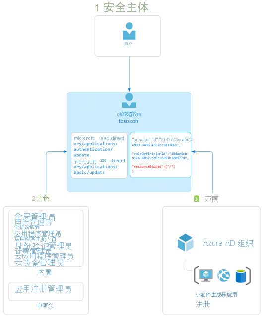

# Azure Active Directory 中基于角色的访问控制概述

本文介绍如何理解 Azure Active Directory (Azure AD) 基于角色的访问控制。 可通过 Azure AD 角色向管理员授予精细的权限，遵循最低权限原则。 Azure AD 内置和自定义角色的运作原理与[针对 Azure 资源的基于角色的访问控制系统](../../role-based-access-control/overview.md)（Azure 角色）中描述的类似。 [这两个基于角色的访问控制系统的区别](../../role-based-access-control/rbac-and-directory-admin-roles.md)在于：

- Azure AD 角色使用图形 API 控制对 Azure AD 资源（例如用户、组和应用程序）的访问
- Azure 角色使用 Azure 资源管理控制对 Azure 资源（例如虚拟机或存储）的访问

这两个系统都包含角色定义和角色分配，且其用途相似。 但是，Azure AD 角色权限不能用于 Azure 自定义角色，反之亦然。

## 了解 Azure AD 基于角色的访问控制
Azure AD 支持两种类型的角色定义 - 
* [内置角色](./permissions-reference.md)
* [自定义角色](./custom-create.md)

内置角色是具有一系列固定权限的现成角色。 不能修改这些角色定义。 Azure AD 支持许多[内置角色](./permissions-reference.md)，并且支持的角色还在不断增加。 为了完善功能并满足复杂要求，Azure AD 还支持[自定义角色](./custom-create.md)。 使用自定义 Azure AD 角色授予权限的过程分为两个步骤，涉及到创建自定义角色定义，然后使用角色分配来分配该角色。 自定义角色定义是从预设列表添加的权限集合。 这些权限与内置角色中使用的权限相同。  

创建自定义角色定义（或使用内置角色）后，可以通过创建角色分配将其分配给某个用户。 角色分配在指定的范围向用户授予角色定义中的权限。 此双步过程可让你创建单个角色定义，并在不同的范围多次分配它。 范围定义了角色成员有权访问的 Azure AD 资源集。 最常见的范围是组织范围。 可以在组织范围分配自定义角色，这意味着，该角色成员对组织中的所有资源拥有角色权限。 还可以在对象范围分配自定义角色。 对象范围的示例是单个应用程序。 同一个角色可以分配给组织中所有应用程序的某个用户，然后分配给另一个用户，但范围仅限 Contoso Expense Reports 应用。  

Azure AD 内置和自定义角色的运作思路类似于 [Azure 基于角色的访问控制 (Azure RBAC)](../develop/access-tokens.md#payload-claims)。 [这两个基于角色的访问控制系统的区别](../../role-based-access-control/rbac-and-directory-admin-roles.md)在于，Azure RBAC 使用 Azure 资源管理控制对 Azure 资源（例如虚拟机或存储）的访问，Azure AD 自定义角色使用图形 API 控制对 Azure AD 资源的访问。 这两个系统都利用角色定义和角色分配的概念。 Azure AD RBAC 权限不能包含在 Azure 角色中，反之亦然。

### Azure AD 如何确定用户是否有权访问资源

下面是 Azure AD 用于确定你是否有权访问管理资源的概要步骤。 使用此信息可对访问问题进行故障排除。

1. 用户（或服务主体）获取 Microsoft Graph 或 Azure AD Graph 终结点的令牌。
1. 用户使用颁发的令牌通过 Microsoft Graph 或 Azure AD Graph 对 Azure Active Directory (Azure AD) 进行 API 调用。
1. 根据具体情况，Azure AD 会执行以下操作之一：
   - 基于用户访问令牌中的 [wids 声明](../../active-directory-b2c/access-tokens.md)评估用户的角色成员身份。
   - 检索为用户应用于（直接或通过组成员身份）执行操作的资源的所有角色分配。
1. Azure AD 确定 API 调用中的操作是否包含在用户针对此资源拥有的角色中。
1. 如果用户在请求的范围内没有包含该操作的角色，则不授予访问权限。 否则授予访问权限。

## 角色分配

角色分配是一种 Azure AD 资源，它将角色定义附加到特定范围的用户，以授予对 Azure AD 资源的访问权限。   通过创建角色分配来授予访问权限，通过删除角色分配来撤销访问权限。 角色分配的核心包含三个要素：

- Azure AD 用户
- 角色定义
- 资源范围

可以使用 Azure 门户、Azure AD PowerShell 或图形 API 创建[角色分配](custom-create.md)。 还可以[查看自定义角色的分配](custom-view-assignments.md#view-the-assignments-of-a-role)。

下图显示了角色分配的示例。 在此示例中，在 Contoso Widget Builder 应用注册范围为 Chris Green 分配了“应用注册管理员”自定义角色。 此分配仅授予 Chris 对此特定应用注册的“应用注册管理员”角色权限。

### 安全主体

安全主体表示分配了对 Azure AD 资源的访问权限的用户。 用户是在 Azure Active Directory 中具有配置文件的个人。

### 角色

角色定义（或角色）是权限的集合。 角色定义列出可对 Azure AD 资源执行的操作，例如创建、读取、更新和删除。 在 Azure AD 中有两种类型的角色：

- Microsoft 创建的内置角色（无法更改）。
- 由组织创建和管理的自定义角色。

### 范围

范围是指允许对角色分配中的特定 Azure AD 资源执行的操作的限制。 分配角色时，可以指定一个范围来限制管理员对特定资源的访问。 例如，如果要为开发人员授予某个自定义角色，但仅允许该开发人员管理特定的应用程序注册，则你可以在角色分配中包含特定的应用程序注册作为范围。

## 所需的许可计划

在 Azure AD 中可免费使用内置角色，而使用自定义角色则需要 Azure AD Premium P1 许可证。 若要根据需要查找合适的许可证，请参阅[比较免费版、基本版和高级版的正式发布功能](https://azure.microsoft.com/pricing/details/active-directory)。

## 后续步骤

- [了解 Azure AD 角色](concept-understand-roles.md)
- 使用 [Azure 门户、Azure AD PowerShell 或图形 API](custom-create.md) 创建自定义角色分配
- [查看自定义角色的分配](custom-view-assignments.md)