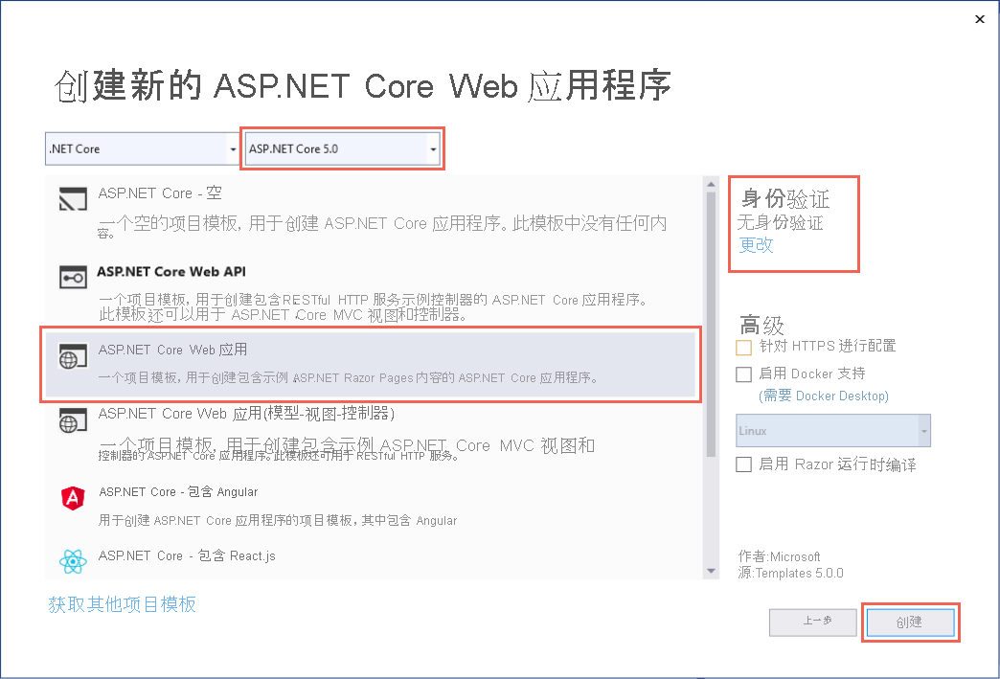
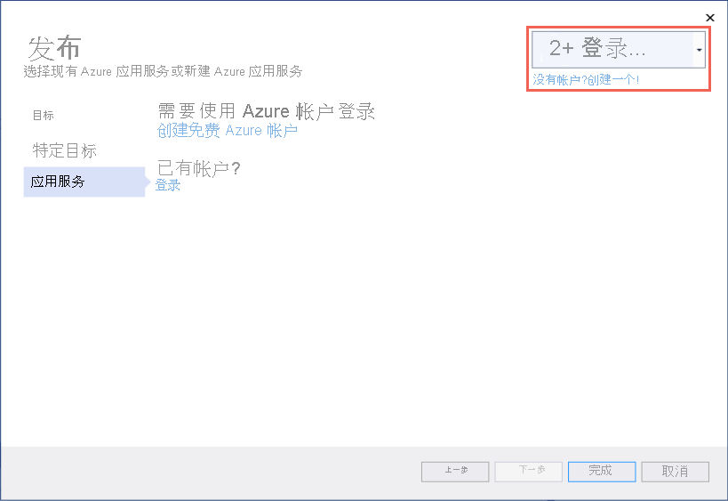
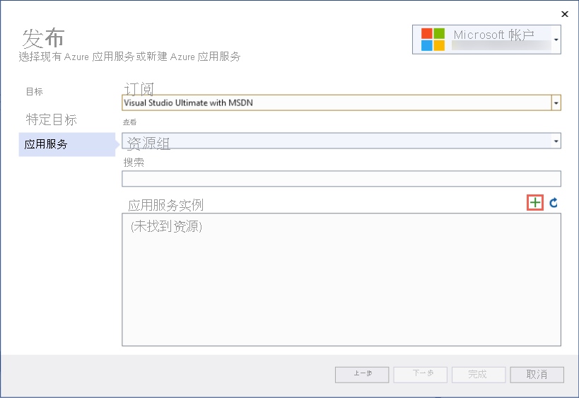
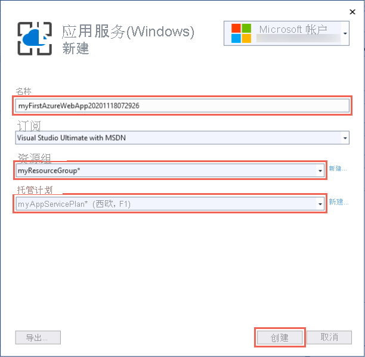
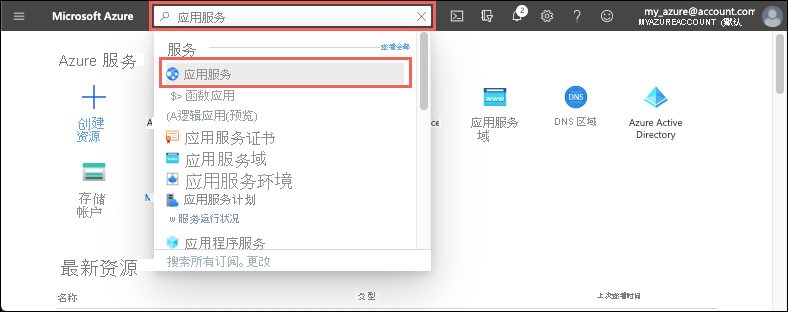
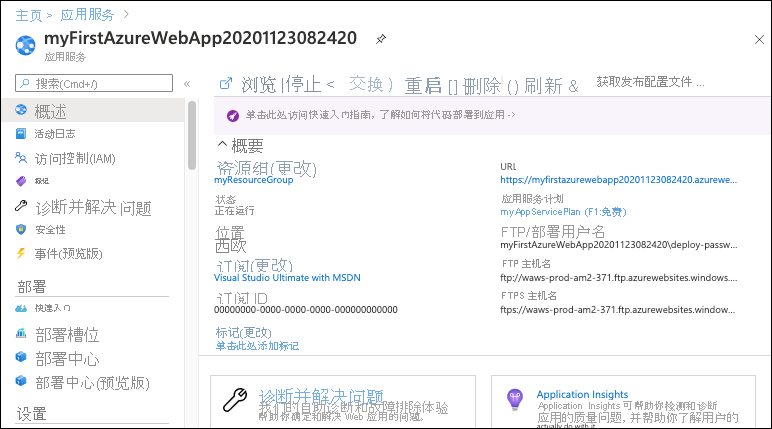

# <a name="quickstart-create-an-aspnet-core-web-app-in-azure"></a>快速入门：在 Azure 中创建 ASP.NET Core Web 应用

::: zone pivot="platform-windows"  

本快速入门介绍如何创建第一个 ASP.NET Core Web 应用并将其部署到 [Azure 应用服务](overview.md)。 应用服务支持 .NET 5.0 应用。

完成后，你将获得一个 Azure 资源组，其中包含一个应用服务托管计划，以及一个部署了 Web 应用程序的应用服务。

## <a name="prerequisites"></a>先决条件

- 具有活动订阅的 Azure 帐户。 [免费创建帐户](https://azure.microsoft.com/free/dotnet/)。
- 安装带有 ASP.NET 和 Web 开发工作负荷的 <a href="https://www.visualstudio.com/downloads/" target="_blank">Visual Studio 2019</a>。

  如果已安装 Visual Studio 2019：

  - 通过选择“帮助” > “检查更新”，在 Visual Studio 中安装最新更新。 最新的更新包含 .NET 5.0 SDK。
  - 通过选择“工具” > “获取工具和功能”，添加工作负荷。


## <a name="create-an-aspnet-core-web-app"></a>创建一个 ASP.NET Core Web 应用

遵循以下步骤在 Visual Studio 中创建 ASP.NET Core Web 应用：

# <a name="net-core-31"></a>[.NET Core 3.1](#tab/netcore31)

1. 打开 Visual Studio 并选择“创建新项目”。

1. 在“创建新项目”中选择“ASP.NET Core Web 应用程序”，确认“C#”列在所选内容的语言中，然后选择“下一步”。

1. 在“配置新项目”中，将 Web 应用程序项目命名为 *myFirstAzureWebApp*，然后选择“创建”。

   

1. 可将任何类型的 ASP.NET Core Web 应用部署到 Azure，但对于本快速入门，请选择“Web 应用程序”模板。 确保“身份验证”设置为“无身份验证”，并且未选择其他选项。 然后选择“创建”。

    
   
1. 在 Visual Studio 菜单中，选择“调试” > “开始执行(不调试)”以在本地运行 Web 应用。

   

# <a name="net-50"></a>[.NET 5.0](#tab/net50)

1. 打开 Visual Studio 并选择“创建新项目”。

1. 在“创建新项目”中选择“ASP.NET Core Web 应用程序”，确认“C#”列在所选内容的语言中，然后选择“下一步”。

1. 在“配置新项目”中，将 Web 应用程序项目命名为 *myFirstAzureWebApp*，然后选择“创建”。

   

1. 对于 .NET 5.0 应用，请在下拉列表中选择“ASP.NET Core 5.0”。

1. 可将任何类型的 ASP.NET Core Web 应用部署到 Azure，但对于本快速入门，请选择“ASP.NET Core Web 应用”模板。 确保“身份验证”设置为“无身份验证”，并且未选择其他选项。 然后选择“创建”。

    
   
1. 在 Visual Studio 菜单中，选择“调试” > “开始执行(不调试)”以在本地运行 Web 应用。

   

---

## <a name="publish-your-web-app"></a>发布 Web 应用

若要发布 Web 应用，必须先创建并配置一个可将应用发布到的新应用服务。 

在设置应用服务的过程中，将会创建：

- 一个新的[资源组](../azure-resource-manager/management/overview.md#terminology)，用于包含该服务的所有 Azure 资源。
- 一个新的[托管计划](./overview-hosting-plans.md)，用于指定托管应用的 Web 服务器场的位置、大小和功能。

遵循以下步骤创建应用服务并发布 Web 应用：

1. 在“解决方案资源管理器”中右键单击“myFirstAzureWebApp”项目，然后选择“发布”。 

1. 在“发布”中，选择“Azure”，然后单击“下一步”  。

1. 你的选项取决于你是否已登录 Azure 以及是否有一个链接到 Azure 帐户的 Visual Studio 帐户。 选择“添加帐户”或“登录”以登录 Azure 订阅。 如果你已经登录，请选择所需的帐户。

   

1. 在“应用服务实例”的右侧，单击“+” 。

   

1. 对于“订阅”，请接受列出的订阅，或从下拉列表中选择一个新订阅。

1. 对于“资源组”，选择“新建”。 在“新资源组名称”中，输入“myResourceGroup”并选择“确定”。 

1. 对于“托管计划”，请选择“新建”。 

1. 在“托管计划:新建”对话框中，输入下表中指定的值：

   | 设置  | 建议的值 | 说明 |
   | -------- | --------------- | ----------- |
   | **托管计划**  | *myFirstAzureWebAppPlan* | 应用服务计划的名称。 |
   | **位置**      | “西欧” | 托管 Web 应用的数据中心。 |
   | **大小**          | *免费* | [定价层](https://azure.microsoft.com/pricing/details/app-service/?ref=microsoft.com&utm_source=microsoft.com&utm_medium=docs&utm_campaign=visualstudio)确定托管功能。 |
   
   

1. 在 **名称** 中，输入仅包含有效字符 `a-z`、`A-Z`、`0-9` 和 `-` 的唯一应用名称。 可以接受自动生成的唯一名称。 Web 应用的 URL 为 `http://<app-name>.azurewebsites.net`，其中 `<app-name>` 是应用名称。

2. 选择“创建”以创建 Azure 资源。

   

   向导完成后，便为你创建了 Azure 资源，你就可以进行发布了。

3. 选择“完成”关闭向导。

1. 在“发布”页中，单击“发布”。 Visual Studio 将生成、打包应用并将其发布到 Azure，然后在默认浏览器中启动该应用。

   

祝贺你！  你的 ASP.NET Core Web 应用已在 Azure 应用服务中实时运行！

## <a name="update-the-app-and-redeploy"></a>更新应用并重新部署

遵循以下步骤更新并重新部署 Web 应用：

1. 在 **解决方案资源管理器** 中你的项目下，打开“页” > “Index.cshtml”。

1. 将整个 `<div>` 标记替换为以下代码：

   ```html
   <div class="jumbotron">
       <h1>ASP.NET in Azure!</h1>
       <p class="lead">This is a simple app that we've built that demonstrates how to deploy a .NET app to Azure App Service.</p>
   </div>
   ```

1. 若要重新部署到 Azure，请在“解决方案资源管理器”中右键单击“myFirstAzureWebApp”项目，然后选择“发布”。

1. 在“发布”摘要页中选择“发布” 。

   <!--  -->

    发布完成后，Visual Studio 将启动浏览器并转到 Web 应用的 URL。

    

## <a name="manage-the-azure-app"></a>管理 Azure 应用

若要管理 Web 应用，请转到 [Azure 门户](https://portal.azure.com)，然后搜索并选择“应用服务”。



在“应用服务”页上，选择 Web 应用的名称。

:::image type="content" source="./media/quickstart-dotnetcore/select-app-service.png" alt-text="“应用程序服务”页面的屏幕截图，显示已选择一个示例 Web 应用。":::

Web 应用的“概述”页包含用于基本管理（例如浏览、停止、启动、重启和删除）的选项。 左侧菜单提供用于配置应用的更多页面。



[!INCLUDE [Clean-up section](../../includes/clean-up-section-portal.md)]

## <a name="next-steps"></a>后续步骤

在本快速入门中，你已使用 Visual Studio 创建了一个 ASP.NET Core Web 应用，并已将其部署到 Azure 应用服务。

请继续学习下一篇文章，了解如何创建 .NET Core 应用并将其连接到 SQL 数据库：

> [!div class="nextstepaction"]
> [将 ASP.NET Core 与 SQL 数据库配合使用](tutorial-dotnetcore-sqldb-app.md)

> [!div class="nextstepaction"]
> [配置 ASP.NET Core 应用](configure-language-dotnetcore.md)

::: zone-end  

::: zone pivot="platform-linux"
[Linux 应用服务](overview.md#app-service-on-linux)使用 Linux 操作系统，提供高度可缩放的自修补 Web 托管服务。 本快速入门演示如何在 Linux 应用服务中创建 [.NET Core](/aspnet/core/) 应用。 使用 [Azure CLI](/cli/azure/get-started-with-azure-cli) 创建应用，并使用 Git 将 .NET Core 代码部署到该应用。


可以使用 Mac、Windows 或 Linux 计算机执行本文中的步骤。

[!INCLUDE [quickstarts-free-trial-note](../../includes/quickstarts-free-trial-note.md)]

## <a name="set-up-your-initial-environment"></a>设置初始环境

# <a name="net-core-31"></a>[.NET Core 3.1](#tab/netcore31)

若要完成本快速入门教程，需先执行以下操作：

* <a href="https://dotnet.microsoft.com/download/dotnet-core/3.1" target="_blank">安装最新的 .NET Core 3.1 SDK</a>。
* 安装最新的 Azure CLI。

# <a name="net-50"></a>[.NET 5.0](#tab/net50)

若要完成本快速入门教程，需先执行以下操作：

* <a href="https://dotnet.microsoft.com/download/dotnet/5.0" target="_blank">安装最新的 .NET 5.0 SDK</a>。
* 安装最新的 Azure CLI。

---

[存在问题？请告诉我们。](https://aka.ms/DotNetAppServiceLinuxQuickStart)

## <a name="create-the-app-locally"></a>在本地创建应用

在计算机的终端窗口中，创建一个名为 `hellodotnetcore` 的目录，并将当前目录切换到该目录。

```bash
mkdir hellodotnetcore
cd hellodotnetcore
```

创建新的 .NET Core 应用。

```bash
dotnet new web
```

## <a name="run-the-app-locally"></a>在本地运行应用

在本地运行应用程序，以便你能了解将它部署到 Azure 时它的外观应该是什么样的。 

```bash
dotnet run
```

打开 Web 浏览器并导航到 `http://localhost:5000` 处的应用。

页面中会显示该示例应用发出的 Hello World  消息。


[存在问题？请告诉我们。](https://aka.ms/DotNetAppServiceLinuxQuickStart)

## <a name="sign-into-azure"></a>登录 Azure
在终端窗口中，通过以下命令登录到 Azure：

```azurecli
az login
```

## <a name="deploy-the-app"></a>部署应用

使用 `az webapp up` 命令在本地文件夹 (hellodotnetcore) 中部署代码：

```azurecli
az webapp up --sku F1 --name <app-name> --os-type linux
```

- 如果无法识别 `az` 命令，请确保按照[设置初始环境](#set-up-your-initial-environment)中所述安装 Azure CLI。
- 将 `<app-name>` 替换为在整个 Azure 中均唯一的名称（有效字符为 `a-z`、`0-9` 和 `-`）。 良好的模式是结合使用公司名称和应用标识符。
- `--sku F1` 参数在“免费”定价层上创建 Web 应用。 省略此参数可使用更快的高级层，这会按小时计费。
- 可以选择包含参数 `--location <location-name>`，其中 `<location-name>` 是可用的 Azure 区域。 可以运行 [`az account list-locations`](/cli/azure/appservice#az-appservice-list-locations) 命令来检索 Azure 帐户的允许区域列表。

此命令可能需要花费几分钟时间完成。 运行时，它提供以下相关信息：创建资源组、应用服务计划和托管应用，配置日志记录，然后执行 ZIP 部署。 然后，它将显示消息“可以在 http://&lt;app-name&gt;.azurewebsites.net（这是 Azure 上应用的 URL）启动应用”。

# <a name="net-core-31"></a>[.NET Core 3.1](#tab/netcore31)


# <a name="net-50"></a>[.NET 5.0](#tab/net50)

<!-- Deploy the code in your local folder (*hellodotnetcore*) using the `az webapp up` command:

```azurecli
az webapp up --sku B1 --name <app-name> --os-type linux
```

- If the `az` command isn't recognized, be sure you have the Azure CLI installed as described in [Set up your initial environment](#set-up-your-initial-environment).
- Replace `<app-name>` with a name that's unique across all of Azure (*valid characters are `a-z`, `0-9`, and `-`*). A good pattern is to use a combination of your company name and an app identifier.
- The `--sku B1` argument creates the web app in the Basic pricing tier, which incurs an hourly cost. Omit this argument to use a faster premium tier, which costs more.
- You can optionally include the argument `--location <location-name>` where `<location-name>` is an available Azure region. You can retrieve a list of allowable regions for your Azure account by running the [`az account list-locations`](/cli/azure/appservice#az-appservice-list-locations) command.

The command may take a few minutes to complete. While running, it provides messages about creating the resource group, the App Service plan and hosting app, configuring logging, then performing ZIP deployment. It then gives the message, "You can launch the app at http://&lt;app-name&gt;.azurewebsites.net", which is the app's URL on Azure. -->


---

[存在问题？请告诉我们。](https://aka.ms/DotNetAppServiceLinuxQuickStart)

[!include [az webapp up command note](../../includes/app-service-web-az-webapp-up-note.md)]

## <a name="browse-to-the-app"></a>浏览到应用

使用 Web 浏览器浏览到已部署的应用程序。

```bash
http://<app_name>.azurewebsites.net
```

.NET Core 示例代码在包含内置映像的 Linux 上的应用服务中运行。


祝贺你！  现已将第一个 .NET Core 应用部署到 Linux 应用服务。

[存在问题？请告诉我们。](https://aka.ms/DotNetAppServiceLinuxQuickStart)

## <a name="update-and-redeploy-the-code"></a>更新并重新部署代码

在本地目录中，打开 Startup.cs 文件  。 对方法调用 `context.Response.WriteAsync` 中的文本稍作更改：

```csharp
await context.Response.WriteAsync("Hello Azure!");
```

保存更改，然后再次使用 `az webapp up` 命令重新部署应用：

```azurecli
az webapp up --os-type linux
```

此命令使用本地缓存在 .azure/config 文件中的值，包括应用名称、资源组和应用服务计划。

完成部署后，切换回在“浏览到应用”  步骤中打开的浏览器窗口，并点击“刷新”。


[存在问题？请告诉我们。](https://aka.ms/DotNetAppServiceLinuxQuickStart)

## <a name="manage-your-new-azure-app"></a>管理新的 Azure 应用

转到 <a href="https://portal.azure.com" target="_blank">Azure 门户</a>管理已创建的应用。

在左侧菜单中单击 **应用程序服务**，然后单击 Azure 应用的名称。

:::image type="content" source="./media/quickstart-dotnetcore/portal-app-service-list-up.png" alt-text="“应用程序服务”的屏幕截图，显示已选择一个示例 Azure 应用。":::

这里我们可以看到应用的“概述”页。 并可以执行基本的管理任务，例如浏览、停止、启动、重新启动和删除。 


左侧菜单提供了用于配置应用的不同页面。 

[!INCLUDE [cli-samples-clean-up](../../includes/cli-samples-clean-up.md)]

[存在问题？请告诉我们。](https://aka.ms/DotNetAppServiceLinuxQuickStart)

## <a name="next-steps"></a>后续步骤

> [!div class="nextstepaction"]
> [教程：将 ASP.NET Core 应用与 SQL 数据库配合使用](tutorial-dotnetcore-sqldb-app.md)

> [!div class="nextstepaction"]
> [配置 ASP.NET Core 应用](configure-language-dotnetcore.md)

::: zone-end
