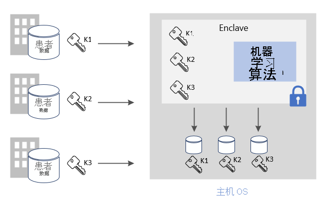
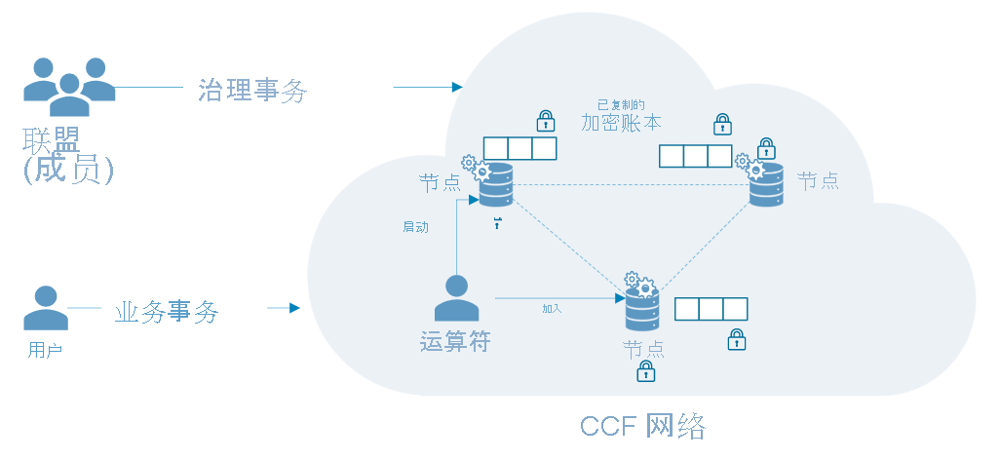

# Azure 机密计算的常见场景

本文概述了 Azure 机密计算的几个常见场景。 本文中的建议可以作为使用机密计算服务和框架开发应用程序的一个起点。 

阅读本文后，可以回答以下问题：

- Azure 机密计算有哪些场景？
- 将 Azure 机密计算用于多方场景有什么好处？
- 在区块链网络上使用 Azure 机密计算有什么好处？

## 保护多方计算
通过 Azure 机密计算，可以处理来自多个源的数据，而不会向其他方公开输入数据。 这种类型的安全计算支持多种场景，如反洗钱、欺诈检测和医疗保健数据的安全分析。

多个源可以将其数据上传到虚拟机中的一个 enclave。 一方告诉 enclave 对数据进行计算或处理。 任何一方（甚至执行分析的一方）都看不到已上传到 enclave 中的其他方的数据。 

在安全多方计算中，已加密的数据将进入 enclave，enclave 使用密钥解密数据，执行分析，获取结果，并发送回一方可以使用指定密钥进行解密的加密结果。 

**保护正在使用的数据**： 
- 在 Azure 上使用 DCsv2 系列虚拟机 (VM)，启用 Intel SGX 支持。 这些 VM 受到受信任的执行环境 (TEE) 支持，该环境保护和隔离应用程序数据和代码的各部分。
- 使用可感知 enclave 的 SDK 在虚拟机内创建 enclave。 在 enclave 中，数据不会向任何一方公开，即使是 VM 提供程序。 enclave 中的数据将由硬件支持进行加密。
    - 例如，可以将 [OE SDK](https://github.com/openenclave/openenclave) 用于服务器端处理。 

**保护传输中的数据** 
- 使用经证明的 TLS 作为安全通道来保证传输中数据的安全性
- 客户端确保仅将数据发送到受 enclave 保护的同一服务器。 

**保护静态数据**
- 使用受保护和安全的数据存储来确保静态数据的安全性 

### 反洗钱
在这个安全的多方计算示例中，多个银行彼此共享数据，不会公开其客户的个人数据。 银行对合并的敏感数据集运行经过一致同意的分析。 对聚合数据集的分析可以检测一个用户在多个银行之间的资金流动，各银行之间不会互相访问数据。

通过机密计算，这些金融机构可以提高欺诈检测率，处理洗钱场景，减少误报，并持续从较大数据集中学习。 

### 医疗保健行业的药物研发
相互合作的医疗保健机构提供专用医疗保健数据集来训练 ML 模型。 每个机构只能看到自己的数据集。 没有其他机构能够看到数据或训练模型，甚至云提供商也不能。 

所有机构都可通过使用经过训练的模型获益。 通过使用更多数据创建模型，模型变得更准确。 参与训练模型的每个机构都可以使用该模型并收到有用的结果。 

## 区块链

区块链网络是节点的分散网络。 这些节点由操作员或验证员运行和维护，他们希望确保完整性并在网络状态上达成共识。 节点本身是账本的副本，用于跟踪区块链事务。 每个节点都有事务历史记录的完整副本，确保分布式网络中的完整性和可用性。

基于机密计算的区块链技术可以使用基于硬件的隐私来实现数据机密性和安全计算。 在某些情况下，整个账本是加密的，以保护数据访问。 有时，事务本身可以出现在节点中的 enclave 内的计算模块中。

### 机密联盟框架 (CCF)
[CCF](https://www.microsoft.com/research/project/confidential-consortium-framework/) 是在 Azure 机密计算基础上构建的分布式区块链框架的一个示例。 此框架由 Microsoft Research 率先使用，利用受信任的执行环境 (TEE) 的强大功能来创建远程 enclave 的网络以进行证明。 节点可以在 Azure 虚拟机（[DCsv2 系列](confidential-computing-enclaves.md)）上运行并利用 enclave 基础结构。 通过证明协议，区块链的用户可以验证一个 CCF 节点的完整性，并有效验证整个网络。 

在 CCF 中，分散账本由在所有网络节点中复制的键值存储的已记录更改组成。 其中每个节点都运行由区块链用户通过 TLS 触发的事务引擎。 触发终结点时，会改变键值存储。 在加密的更改记录到分散的账本之前，它必须经过一定数量的节点同意才能达成共识。 

## 后续步骤
[部署](quick-create-marketplace.md) DCsv2 系列虚拟机。

